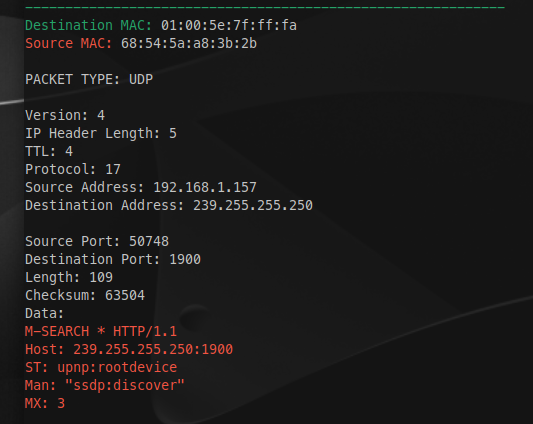

<h1 align="center">Pyket</h1>

<p  align="center">


</p>

A simple (and bad) packet sniffer written in Python 3.

## Features

 - Automatically detect wireless network interface
 - IPv4 sniffing
 - Support for TCP, UDP, and ICMP Packets

## Installation
Clone this repository, cd into the cloned directory. Install ``colorama`` via pip.

```bash
git clone https://github.com/mokeWe/Pyket
pip install colorama
cd Pyket
```
Execute ``main.py`` as root for Linux based operating systems, 
```bash
sudo python3 main.py
```
On Windows you can double click ``main.py`` or execute it via the command prompt

## Screenshots


This entire thing was made in an afternoon and it's quite bad.
